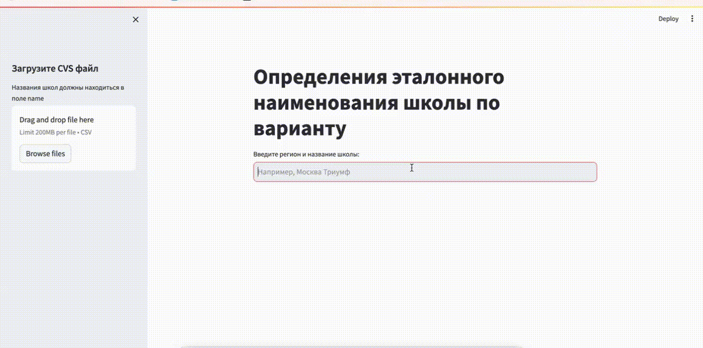

# NLP модель сопоставления вариантов названия спортивных школ

Стек: Python, Pandas, Numpy, Torch, Sentence-transformers.

 

**Описание проекта.**\
Заказчик – сервис  “Мой Чемпион”, который помогает спортивным школам фигурного катания, тренерам мониторить результаты своих подопечных и планировать дальнейшее развитие спортсменов. При сборе данных одна и та же школа может быть записана по разному, например, "Республика Татарстан, СШОР ФСО Авиатор" и "Республика Татарстан, МБУ СШОР ФСО Авиатор г.Казань".

**Поставленная задача:**\
Создать решение для стандартизации названий спортивных школ. Нужно сопоставить варианты эталонному названию из предоставленной таблицы.

## Результат:
Разработан сервис сопоставления вариантов названий школ с эталоном.

В эталонных названиях школ содержится множество неявных дубликатов, одна и таже школа имеет разные названия и id. Это добавило сложности в процесс оценки эффективности решения.

Выбрана модель SentenceTransformer с весами 'paraphrase-MiniLM-L6-v2', которая дала точность на эталонных наименованиях школ более 72%.

В дальнейших планах можно увеличить точность, если очистить эталонный датасет школ, а также разбить процесс на 2 этапа:
1. Найти схожесть региона;
2. Внутри региона найти схожесть наименования школы.

## Выводы и рекомендации
Было установленно, что решить задачу в первоначальной формулировке и с первоначально полученными данными невозможно. В вариантах названий школы без региона:
- "СШОР ""Надежда Губернии";
- СШ по ЗВС;
- СШ №2;
- Пируэт.

Если даже предположить, что "Надежда Губернии" - это уникальное название во всей стране, то вот остальные, такие как СШ №2 встречаются в разных городах. Без варианта названия региона нельзя предсказать регион.

Рекомендация заказчику – собирать ИНН школы в отдельном поле, по которому без ошибок и машинного обучения можно сопоставлять данные. Если сбор ИНН будет невозможен, то менеджеру хотя бы вручную указывать регион из которого он эти данные получил.
